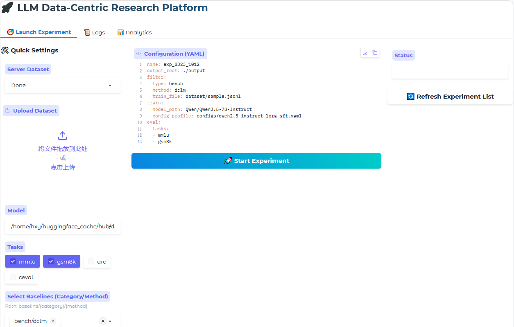

# Data Select Bench
A unified, modular pipeline for LLM data selector, fine-tuning, and benchmarking. This platform allows researchers to evaluate various data filtering strategies (baselines) across different models and tasks in a reproducible manner.


## 🌟 Overview

This platform automates the end-to-end workflow of data-centric AI:
1.  **Filtering**: Selecting high-quality subsets from raw datasets using diverse baselines.
2.  **Training**: Fine-tuning LLMs (e.g., Qwen, Llama) using the filtered data.
3.  **Evaluation**: Benchmarking the resulting models on standard tasks (MMLU, GSM8K, etc.).

All artifacts—filtered datasets, model checkpoints, and evaluation reports—are automatically organized within a unique experiment directory for full traceability.

---

## 🏗️ Architecture & Baselines

The project is structured to support extensible data selection methods located in the `baseline/` directory:

| Category | Description | Examples |
| :--- | :--- | :--- |
| **Agent** | Agent-based autonomous data processing. | `baseline/agent` |
| **Bench** | Standard data curation benchmarks. | `baseline/bench/` |
| **Surrogate-Based** | Methods using small models to score data for large models. | `baseline/surrogate_based` |
| **Surrogate-Free** | Self-scoring or intrinsic data quality metrics. | `baseline/surrogate_free` |

---

## 🚀 Quick Start

### 1. Environment Setup
The platform uses specialized Conda environments for different stages to avoid dependency conflicts.

### 2. Configuration
The following YAML configuration defines a full pipeline including **Data Filtering** (via DFA Agent), **Model Training** (via LlamaFactory), and **Evaluation** (via LM-Eval-Harness). 

Save this file as `configs/dfa.yaml` before running the pipeline.

```yaml
# Pipeline Metadata
name: "dfa_qwen2.5_test"
output_root: "./output"

# 1. Data Selection (Filtering) Stage
filter:
  type: "agent"              # Selection category: Agent-based
  method: "dfa"              # Specific method: Data-Flow Analysis
  step: 1                    # DFA-specific: Target step for output extraction
  args:
    train_file: "dataset/intermediate/openhermes2_5_extracted_sample/openhermes2_5_extracted_sample_extracted.jsonl"
    filtered_file: "final_filtered_file.jsonl"
    api_key: "your_api_key_here"
    api_url: "http://your_api_endpoint:3001/v1"
    target: "Data Filtering"  # Prompt for Operator Matching Agent
    writer_target: "Generate executable code and save filtered training data" # Prompt for Code Gen Agent

# 2. Training Stage (SFT via LlamaFactory)
train:
  model_path: "Qwen/Qwen2.5-7B-Instruct"
  config_profile: "configs/lora_sft.yaml" # Path to LlamaFactory LoRA config
  template: "qwen3_nothink"

# 3. Evaluation Stage (LM-Eval-Harness)
eval:
  tasks: 
    - "mmlu"
  num_fewshot: 0           # Zero-shot evaluation
  batch_size: 4           
  device: "cuda:0"
```

### 3. Run Pipeline

You can execute the entire data selection pipeline with a single command. The system will automatically reference the environment configurations specified in `docs/{method}.md` and initiate the corresponding selection logic.

#### Currently Implemented Methods
The following methods are currently supported (more are being added):

* **Agent Methods**
    * `dfa`: Data-Flow Analysis
* **Bench Methods** 
    * `dclm`: Data-Centric Language Modeling (Extracted from the official DCLM-bench data filtering suite)
* **Surrogate Free Methods**
    * `cherry_llm`: Cherry-picking for Large Language Models

#### Execution Command
To run the pipeline, set the `METHOD` variable and execute the entry script:

```bash
# 1. Set the method (options: dfa, dclm, cherry_llm)
export METHOD=dfa 

# 2. (Optional) Set mirror endpoint to avoid download hangs
export HF_ENDPOINT="[https://hf-mirror.com](https://hf-mirror.com)"

# 3. Configure environment and launch the pipeline
cd data_selection && bash scripts/run_${METHOD}.sh
```

### 4. Visual
```bash
cd data_selection
conda env create -f env_config/bench.yaml
conda activate bench
python gradio_app/app.py
```


---

## 📂 Experiment Management

The platform automatically generates a unique `exp_id` and directory structure for every run:
`output/{Method}_{Dataset}_{Model}__{Timestamp}/`

```text
├── experiment_config.yaml  # Backup of the original config
├── filter.log              # Logs from the filtering stage
├── train.log               # Logs from the SFT stage
├── eval.log                # Logs from the evaluation stage
├── final_filtered_file.jsonl # The selected data subset
├── adapter_model/          # Trained PEFT/LoRA weights
└── eval_results/           # JSON/Markdown evaluation metrics
```
---


## 📈 Roadmap
- [ ] Support for Multi-GPU Distributed Data Processing.
- [ ] Integration with more surrogate-based/free and agent models.
- [ ] Automated visualization of Loss vs. Data Ratio curves.
---
